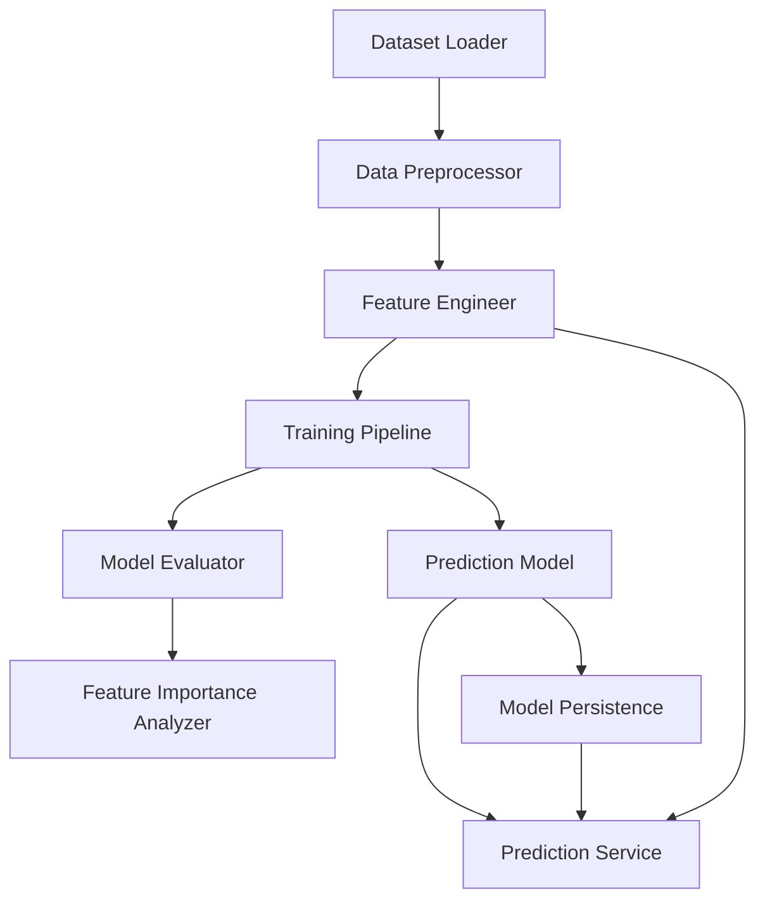

# Design Document: COVID-19 Prediction Model

## Overview

This document describes the design of a COVID-19 prediction system that uses machine learning to predict whether an individual will test positive for COVID-19 based on their symptoms, demographics, and test indication. The system follows a modular architecture separating data loading, preprocessing, model training, evaluation, and prediction services.

### System Goals

- Provide accurate COVID-19 predictions based on symptoms and demographics
- Handle class imbalance in the dataset (positive cases are minority class)
- Support model persistence and reusability
- Enable model interpretability through feature importance analysis
- Validate model generalization through cross-validation

### Key Design Decisions

1. **Modular Architecture**: Separate components for data loading, preprocessing, feature engineering, training, evaluation, and prediction to enable independent testing and reusability
2. **Scikit-learn Framework**: Use scikit-learn as the primary ML framework for its robust preprocessing, model selection, and evaluation capabilities
3. **Multiple Algorithm Support**: Support logistic regression, random forest, and gradient boosting to allow algorithm comparison
4. **Algorithm-Specific Feature Engineering**: Apply feature engineering (interactions, polynomial features, scaling) only for linear models (logistic regression) where it provides significant benefit; tree-based models work with raw features
5. **Class Balancing**: Apply class weights or SMOTE (Synthetic Minority Over-sampling Technique) to handle imbalanced dataset
6. **Model Serialization**: Use joblib for efficient model persistence (better than pickle for large numpy arrays); include feature engineering transformations in saved models
7. **Configuration-Driven**: Use configuration files or parameters for hyperparameters, file paths, and training options

## Architecture

### System Components



### Component Responsibilities

1. **Dataset Loader**: Loads CSV data, validates schema, handles file errors
2. **Data Preprocessor**: Cleans data, encodes categorical variables, handles missing values, splits train/test
3. **Feature Engineer**: Creates interaction features, polynomial features, and applies feature scaling for linear models
4. **Training Pipeline**: Orchestrates model training, applies class balancing, performs cross-validation
5. **Prediction Model**: Encapsulates trained ML algorithm (logistic regression, random forest, or gradient boosting)
6. **Model Evaluator**: Computes performance metrics (accuracy, precision, recall, F1, AUC-ROC, confusion matrix)
7. **Feature Importance Analyzer**: Extracts and visualizes feature importance scores
8. **Prediction Service**: Loads trained model, validates input, generates predictions
9. **Model Persistence**: Saves and loads trained models with metadata

### Data Flow

1. **Training Flow**: CSV → Dataset Loader → Data Preprocessor → Feature Engineer → Training Pipeline → Trained Model → Model Persistence
2. **Evaluation Flow**: Test Data → Feature Engineer → Trained Model → Model Evaluator → Performance Metrics
3. **Prediction Flow**: Feature Vector → Input Validator → Feature Engineer → Prediction Service → Prediction Result

## Components and Interfaces

### 1. Dataset Loader

**Module**: `data_loader.py`

**Class**: `CovidDatasetLoader`

**Methods**:
```python
def load_dataset(file_path: str) -> pd.DataFrame:
    """
    Load COVID test dataset from CSV file.
    
    Args:
        file_path: Path to CSV file
        
    Returns:
        DataFrame containing loaded data
        
    Raises:
        FileNotFoundError: If file does not exist
        ValueError: If required columns are missing
    """
```

```python
def validate_schema(df: pd.DataFrame, required_columns: List[str]) -> bool:
    """
    Validate that DataFrame contains required columns.
    
    Args:
        df: DataFrame to validate
        required_columns: List of required column names
        
    Returns:
        True if valid
        
    Raises:
        ValueError: If columns are missing (with list of missing columns)
    """
```

**Required Columns**:
- test_date
- cough, fever, sore_throat, shortness_of_breath, head_ache
- corona_result
- age_60_and_above
- gender
- test_indication

### 2. Data Preprocessor

**Module**: `preprocessor.py`

**Class**: `CovidDataPreprocessor`

**Methods**:
```python
def preprocess(df: pd.DataFrame, config: PreprocessConfig) -> Tuple[np.ndarray, np.ndarray]:
    """
    Preprocess raw data for model training.
    
    Args:
        df: Raw DataFrame
        config: Preprocessing configuration
        
    Returns:
        Tuple of (feature_matrix, target_vector)
    """
```

```python
def handle_missing_values(df: pd.DataFrame, strategy: str = 'drop') -> pd.DataFrame:
    """
    Handle missing values in dataset.
    
    Args:
        df: DataFrame with potential missing values
        strategy: 'drop' or 'impute'
        
    Returns:
        DataFrame with missing values handled
    """
```

```python
def encode_categorical(df: pd.DataFrame) -> pd.DataFrame:
    """
    Encode categorical variables to numeric.
    
    Encoding scheme:
    - gender: male=0, female=1
    - age_60_and_above: No=0, Yes=1
    - test_indication: LabelEncoder (ordinal encoding)
    - corona_result: negative=0, positive=1
    
    Args:
        df: DataFrame with categorical columns
        
    Returns:
        DataFrame with encoded columns
    """
```

```python
def split_data(X: np.ndarray, y: np.ndarray, test_size: float = 0.2, 
               random_state: int = 42) -> Tuple[np.ndarray, np.ndarray, np.ndarray, np.ndarray]:
    """
    Split data into training and testing sets.
    
    Args:
        X: Feature matrix
        y: Target vector
        test_size: Proportion of data for testing
        random_state: Random seed for reproducibility
        
    Returns:
        Tuple of (X_train, X_test, y_train, y_test)
    """
```

**Preprocessing Steps**:
1. Handle missing values in age_60_and_above column
2. Encode categorical variables (gender, test_indication, corona_result)
3. Ensure symptom features are binary (0/1)
4. Split into train/test sets with stratification

### 3. Feature Engineer

**Module**: `feature_engineering.py`

**Class**: `FeatureEngineer`

**Purpose**: Creates engineered features to improve model performance, particularly for linear models like logistic regression. Tree-based models (random forest, gradient boosting) can work with raw features, but linear models benefit significantly from feature engineering.

**Methods**:
```python
def __init__(self, algorithm: str = 'logistic_regression'):
    """
    Initialize feature engineer with algorithm-specific configuration.
    
    Args:
        algorithm: 'logistic_regression', 'random_forest', or 'gradient_boosting'
                  Determines which feature engineering steps to apply
    """
```

```python
def fit_transform(self, X: np.ndarray, feature_names: List[str]) -> Tuple[np.ndarray, List[str]]:
    """
    Fit feature engineering transformations and transform training data.
    
    Args:
        X: Training feature matrix (n_samples, n_features)
        feature_names: List of original feature names
        
    Returns:
        Tuple of (transformed_features, new_feature_names)
        
    Note:
        - For logistic regression: applies interaction features, polynomial features, and scaling
        - For tree-based models: returns original features (no engineering needed)
    """
```

```python
def transform(self, X: np.ndarray) -> np.ndarray:
    """
    Transform new data using fitted transformations.
    
    Args:
        X: Feature matrix to transform
        
    Returns:
        Transformed feature matrix
        
    Raises:
        RuntimeError: If transform called before fit_transform
    """
```

```python
def create_interaction_features(self, X: np.ndarray, symptom_indices: List[int]) -> np.ndarray:
    """
    Create pairwise interaction features between symptoms.
    
    Interactions capture co-occurrence patterns like:
    - fever AND cough
    - shortness_of_breath AND fever
    - sore_throat AND cough
    
    Args:
        X: Feature matrix
        symptom_indices: Indices of symptom columns (binary features)
        
    Returns:
        Array of interaction features (n_samples, n_interactions)
        where n_interactions = n_symptoms * (n_symptoms - 1) / 2
    """
```

```python
def create_polynomial_features(self, X: np.ndarray, degree: int = 2) -> np.ndarray:
    """
    Create polynomial features to capture non-linear relationships.
    
    For degree=2, creates:
    - Original features: x1, x2, x3, ...
    - Squared features: x1^2, x2^2, x3^2, ...
    - Interaction features: x1*x2, x1*x3, x2*x3, ...
    
    Args:
        X: Feature matrix
        degree: Polynomial degree (typically 2 for binary features)
        
    Returns:
        Array with polynomial features
        
    Note:
        Uses sklearn.preprocessing.PolynomialFeatures with include_bias=False
    """
```

```python
def apply_feature_scaling(self, X: np.ndarray) -> np.ndarray:
    """
    Apply standardization (z-score normalization) to features.
    
    Transforms features to have mean=0 and std=1.
    Critical for logistic regression to ensure:
    - Faster convergence
    - Proper regularization
    - Comparable feature coefficients
    
    Args:
        X: Feature matrix
        
    Returns:
        Scaled feature matrix
        
    Note:
        Uses sklearn.preprocessing.StandardScaler
        Scaler is fitted during fit_transform and reused in transform
    """
```

```python
def get_feature_names(self) -> List[str]:
    """
    Get names of all engineered features.
    
    Returns:
        List of feature names including:
        - Original features
        - Interaction features (e.g., 'fever_AND_cough')
        - Polynomial features (e.g., 'age_60_and_above^2')
    """
```

**Feature Engineering Strategy by Algorithm**:

1. **Logistic Regression**:
   - Apply ALL feature engineering steps
   - Interaction features: Capture symptom co-occurrence patterns
   - Polynomial features: Enable non-linear decision boundaries
   - Feature scaling: Essential for convergence and regularization
   - Rationale: Linear models need help to capture complex patterns

2. **Random Forest**:
   - NO feature engineering (use raw features)
   - Rationale: Tree-based models automatically:
     - Find interactions through splits
     - Handle non-linear relationships
     - Are scale-invariant

3. **Gradient Boosting**:
   - NO feature engineering (use raw features)
   - Rationale: Same as random forest

**Implementation Details**:

```python
# Example: Creating symptom interaction features
# Original features: [fever, cough, sore_throat, shortness_of_breath, head_ache]
# Interaction features created:
# - fever_AND_cough = fever * cough
# - fever_AND_sore_throat = fever * sore_throat
# - fever_AND_shortness_of_breath = fever * shortness_of_breath
# - fever_AND_head_ache = fever * head_ache
# - cough_AND_sore_throat = cough * sore_throat
# - cough_AND_shortness_of_breath = cough * shortness_of_breath
# - cough_AND_head_ache = cough * head_ache
# - sore_throat_AND_shortness_of_breath = sore_throat * shortness_of_breath
# - sore_throat_AND_head_ache = sore_throat * head_ache
# - shortness_of_breath_AND_head_ache = shortness_of_breath * head_ache
# Total: 10 interaction features from 5 symptoms
```

**Persistence**:
- Feature engineering transformations (scaler, polynomial feature generator) must be saved with the model
- Prediction service must apply the same transformations to new data
- Metadata should include: algorithm, feature_engineering_applied (bool), engineered_feature_names

### 4. Training Pipeline

**Module**: `training.py`

**Class**: `TrainingPipeline`

**Methods**:
```python
def train(X_train: np.ndarray, y_train: np.ndarray, 
          algorithm: str = 'random_forest', 
          balance_classes: bool = True,
          hyperparameters: Dict = None) -> Any:
    """
    Train prediction model.
    
    Args:
        X_train: Training features
        y_train: Training labels
        algorithm: 'logistic_regression', 'random_forest', or 'gradient_boosting'
        balance_classes: Whether to apply class balancing
        hyperparameters: Algorithm-specific hyperparameters
        
    Returns:
        Trained model object
    """
```

```python
def cross_validate(X: np.ndarray, y: np.ndarray, 
                   algorithm: str, n_folds: int = 5) -> Dict[str, Any]:
    """
    Perform k-fold cross-validation.
    
    Args:
        X: Feature matrix
        y: Target vector
        algorithm: Model algorithm to use
        n_folds: Number of folds
        
    Returns:
        Dictionary with mean and std of metrics across folds
    """
```

```python
def compute_class_weights(y: np.ndarray) -> Dict[int, float]:
    """
    Compute class weights for imbalanced dataset.
    
    Args:
        y: Target vector
        
    Returns:
        Dictionary mapping class labels to weights
    """
```

**Supported Algorithms**:
- **Logistic Regression**: Fast, interpretable, good baseline
- **Random Forest**: Handles non-linear relationships, provides feature importance
- **Gradient Boosting (XGBoost)**: High performance, handles imbalance well

**Class Balancing Strategies**:
- Class weights: Penalize misclassification of minority class more heavily
- SMOTE: Synthetic oversampling of minority class
- Undersampling: Reduce majority class samples

### 5. Model Evaluator

**Module**: `evaluation.py`

**Class**: `ModelEvaluator`

**Methods**:
```python
def evaluate(model: Any, X_test: np.ndarray, y_test: np.ndarray) -> Dict[str, Any]:
    """
    Evaluate model performance on test data.
    
    Args:
        model: Trained model
        X_test: Test features
        y_test: Test labels
        
    Returns:
        Dictionary containing all evaluation metrics
    """
```

```python
def compute_metrics(y_true: np.ndarray, y_pred: np.ndarray, 
                    y_prob: np.ndarray) -> Dict[str, float]:
    """
    Compute classification metrics.
    
    Metrics computed:
    - Accuracy
    - Precision (per class and weighted average)
    - Recall (per class and weighted average)
    - F1-score (per class and weighted average)
    - AUC-ROC
    
    Args:
        y_true: True labels
        y_pred: Predicted labels
        y_prob: Prediction probabilities
        
    Returns:
        Dictionary of metric names to values
    """
```

```python
def generate_confusion_matrix(y_true: np.ndarray, y_pred: np.ndarray) -> np.ndarray:
    """
    Generate confusion matrix.
    
    Args:
        y_true: True labels
        y_pred: Predicted labels
        
    Returns:
        2x2 confusion matrix [[TN, FP], [FN, TP]]
    """
```

### 6. Feature Importance Analyzer

**Module**: `feature_importance.py`

**Class**: `FeatureImportanceAnalyzer`

**Methods**:
```python
def extract_importance(model: Any, feature_names: List[str]) -> pd.DataFrame:
    """
    Extract feature importance scores from model.
    
    Args:
        model: Trained model (must support feature_importances_ or coef_)
        feature_names: List of feature names
        
    Returns:
        DataFrame with features and importance scores, sorted by importance
        
    Raises:
        ValueError: If model does not support feature importance
    """
```

```python
def visualize_importance(importance_df: pd.DataFrame, save_path: str = None):
    """
    Create bar plot of feature importance.
    
    Args:
        importance_df: DataFrame with feature importance scores
        save_path: Optional path to save visualization
    """
```

### 7. Prediction Service

**Module**: `prediction.py`

**Class**: `PredictionService`

**Methods**:
```python
def __init__(self, model_path: str):
    """
    Initialize prediction service with trained model.
    
    Args:
        model_path: Path to saved model file
        
    Raises:
        FileNotFoundError: If model file does not exist
        ValueError: If model file is corrupted
    """
```

```python
def predict(self, features: Dict[str, Any]) -> PredictionResult:
    """
    Generate prediction for input features.
    
    Args:
        features: Dictionary containing:
            - cough: int (0 or 1)
            - fever: int (0 or 1)
            - sore_throat: int (0 or 1)
            - shortness_of_breath: int (0 or 1)
            - head_ache: int (0 or 1)
            - age_60_and_above: str ('Yes' or 'No')
            - gender: str ('male' or 'female')
            - test_indication: str
            
    Returns:
        PredictionResult with predicted_class and confidence
        
    Raises:
        ValueError: If features are invalid or missing
    """
```

```python
def validate_features(self, features: Dict[str, Any]) -> bool:
    """
    Validate input features.
    
    Args:
        features: Feature dictionary
        
    Returns:
        True if valid
        
    Raises:
        ValueError: If validation fails (with specific error message)
    """
```

### 8. Model Persistence

**Module**: `model_io.py`

**Functions**:
```python
def save_model(model: Any, metadata: Dict[str, Any], output_dir: str = 'models') -> str:
    """
    Save trained model with metadata.
    
    Args:
        model: Trained model object
        metadata: Dictionary containing:
            - algorithm: str
            - training_date: str
            - dataset_size: int
            - class_balance_method: str (optional)
            - feature_names: List[str]
            - feature_engineering_applied: bool
            - feature_engineer: FeatureEngineer object (if feature engineering was applied)
        output_dir: Directory to save model
        
    Returns:
        Path to saved model file (includes timestamp)
    """
```

```python
def load_model(model_path: str) -> Tuple[Any, Dict[str, Any]]:
    """
    Load trained model and metadata.
    
    Args:
        model_path: Path to model file
        
    Returns:
        Tuple of (model, metadata)
        
    Raises:
        FileNotFoundError: If file does not exist
        ValueError: If file is corrupted
    """
```

```python
def verify_model_compatibility(metadata: Dict[str, Any], 
                               expected_features: List[str]) -> bool:
    """
    Verify loaded model is compatible with current feature schema.
    
    Args:
        metadata: Model metadata
        expected_features: List of expected feature names
        
    Returns:
        True if compatible
        
    Raises:
        ValueError: If incompatible (with details)
    """
```

## Data Models

### Feature Vector Schema

```python
@dataclass
class FeatureVector:
    """Input features for prediction."""
    cough: int  # 0 or 1
    fever: int  # 0 or 1
    sore_throat: int  # 0 or 1
    shortness_of_breath: int  # 0 or 1
    head_ache: int  # 0 or 1
    age_60_and_above: str  # 'Yes' or 'No'
    gender: str  # 'male' or 'female'
    test_indication: str  # Free text
```

### Prediction Result Schema

```python
@dataclass
class PredictionResult:
    """Output from prediction service."""
    predicted_class: str  # 'positive' or 'negative'
    confidence: float  # Probability between 0.0 and 1.0
    timestamp: str  # ISO format timestamp
```

### Training Metadata Schema

```python
@dataclass
class TrainingMetadata:
    """Metadata for trained model."""
    algorithm: str  # 'logistic_regression', 'random_forest', 'gradient_boosting'
    training_date: str  # ISO format
    dataset_size: int  # Number of training samples
    class_balance_method: Optional[str]  # 'class_weights', 'smote', 'undersample', or None
    feature_names: List[str]  # Ordered list of feature names (after feature engineering)
    hyperparameters: Dict[str, Any]  # Algorithm-specific parameters
    class_distribution: Dict[str, int]  # Count of each class in training data
    feature_engineering_applied: bool  # Whether feature engineering was applied
    original_feature_count: int  # Number of features before engineering
    engineered_feature_count: int  # Number of features after engineering
```

### Evaluation Report Schema

```python
@dataclass
class EvaluationReport:
    """Model evaluation results."""
    accuracy: float
    precision_positive: float
    precision_negative: float
    recall_positive: float
    recall_negative: float
    f1_positive: float
    f1_negative: float
    auc_roc: float
    confusion_matrix: np.ndarray  # 2x2 array
    class_distribution: Dict[str, int]  # Test set class counts
```


## Correctness Properties

*A property is a characteristic or behavior that should hold true across all valid executions of a system—essentially, a formal statement about what the system should do. Properties serve as the bridge between human-readable specifications and machine-verifiable correctness guarantees.*

### Property 1: Dataset Loading Preserves Data Completeness

*For any* valid CSV file, loading the dataset should return a DataFrame containing exactly the same number of rows and columns as the source file.

**Validates: Requirements 1.3**

### Property 2: Missing File Paths Raise Errors

*For any* non-existent file path, attempting to load the dataset should raise a FileNotFoundError with a message indicating the missing file.

**Validates: Requirements 1.2**

### Property 3: Missing Required Columns Are Detected

*For any* DataFrame missing one or more required columns (test_date, cough, fever, sore_throat, shortness_of_breath, head_ache, corona_result, age_60_and_above, gender, test_indication), schema validation should fail and return an error message listing all missing columns.

**Validates: Requirements 1.4, 1.5**

### Property 4: Missing Values Are Eliminated

*For any* DataFrame with missing values in the age_60_and_above column, preprocessing should produce output with no missing values in any column.

**Validates: Requirements 2.1**

### Property 5: Categorical Variables Are Encoded

*For any* DataFrame with categorical columns (gender, test_indication, corona_result), preprocessing should produce output where these columns have numeric types.

**Validates: Requirements 2.2**

### Property 6: Symptom Features Are Binary

*For any* preprocessed feature matrix, all symptom columns (cough, fever, sore_throat, shortness_of_breath, head_ache) should contain only values 0 or 1.

**Validates: Requirements 2.3**

### Property 7: Preprocessing Returns Feature Matrix and Target Vector

*For any* input DataFrame, preprocessing should return a tuple (X, y) where X is a 2D array of features and y is a 1D array of target labels.

**Validates: Requirements 2.4**

### Property 8: Train-Test Split Preserves Data Size

*For any* dataset and split ratio r, splitting into train and test sets should satisfy: len(train) + len(test) == len(original) and len(test) / len(original) ≈ r (within tolerance).

**Validates: Requirements 2.5**

### Property 9: Feature Engineering Preserves Sample Count

*For any* feature matrix with n samples, applying feature engineering should produce a transformed matrix with exactly n samples (same number of rows).

**Validates: Requirements 2.4 (implicit - feature engineering is part of preprocessing)**

### Property 10: Interaction Features Are Binary

*For any* pair of binary symptom features, their interaction feature (product) should also be binary (0 or 1).

**Validates: Requirements 2.3 (extended to engineered features)**

### Property 11: Feature Scaling Produces Zero Mean

*For any* feature matrix where feature scaling is applied, each feature column in the scaled matrix should have a mean approximately equal to 0 (within numerical tolerance of 1e-7).

**Validates: Requirements 2.2 (implicit - scaling is part of encoding/transformation)**

### Property 12: Feature Scaling Produces Unit Variance

*For any* feature matrix where feature scaling is applied, each feature column in the scaled matrix should have a standard deviation approximately equal to 1 (within numerical tolerance of 1e-2).

**Validates: Requirements 2.2 (implicit - scaling is part of encoding/transformation)**

### Property 13: Feature Engineering Is Algorithm-Specific

*For any* logistic regression model, feature engineering should be applied and the engineered feature count should be greater than the original feature count. For any tree-based model (random forest, gradient boosting), feature engineering should not be applied and feature count should remain unchanged.

**Validates: Requirements 3.2 (implicit - algorithm selection affects preprocessing)**

### Property 14: Feature Engineering Transform Consistency

*For any* fitted feature engineer and any two identical input feature matrices, applying transform should produce identical output matrices.

**Validates: Requirements 5.2 (implicit - prediction consistency requires consistent transformation)**

### Property 15: Training Produces Valid Model

*For any* valid training data (X_train, y_train) with at least 10 samples and 2 classes, training should successfully produce a model object that has a predict method.

**Validates: Requirements 3.1**

### Property 16: Model Persistence Round-Trip

*For any* trained model, saving to disk and then loading should produce a model that makes identical predictions on the same input data.

**Validates: Requirements 3.3, 7.2**

### Property 17: Training Metadata Is Complete

*For any* trained model, the saved metadata should contain all required fields: algorithm, training_date, dataset_size, feature_names, feature_engineering_applied, original_feature_count, and engineered_feature_count.

**Validates: Requirements 3.4**

### Property 18: Invalid Training Data Raises Errors

*For any* invalid training data (empty arrays, mismatched X and y lengths, single class), training should raise an appropriate error with a descriptive message.

**Validates: Requirements 3.5**

### Property 19: Evaluation Metrics Are Complete and Valid

*For any* model and test dataset, evaluation should return a report containing accuracy, precision (per class), recall (per class), F1-score (per class), AUC-ROC, and confusion matrix, where all probability-based metrics are in [0, 1] and the confusion matrix is a 2x2 array of non-negative integers.

**Validates: Requirements 4.1, 4.2, 4.3, 4.4, 4.5**

### Property 20: Valid Feature Vectors Are Accepted

*For any* feature dictionary containing all required fields (cough, fever, sore_throat, shortness_of_breath, head_ache, age_60_and_above, gender, test_indication) with valid values, the prediction service should accept it and return a prediction without raising an error.

**Validates: Requirements 5.1**

### Property 21: Prediction Results Have Required Structure

*For any* valid prediction, the result should contain a predicted_class field with value 'positive' or 'negative', and a confidence field with a float value in [0.0, 1.0].

**Validates: Requirements 5.3, 5.4**

### Property 22: Missing Features Are Detected

*For any* feature dictionary missing one or more required fields, prediction should raise a ValueError listing all missing features.

**Validates: Requirements 5.5**

### Property 23: Invalid Symptom Values Are Rejected

*For any* symptom feature (cough, fever, sore_throat, shortness_of_breath, head_ache) with a value other than 0 or 1, validation should raise a ValueError indicating the invalid symptom value.

**Validates: Requirements 6.1**

### Property 24: Invalid Gender Values Are Rejected

*For any* gender value not in {'male', 'female'}, validation should raise a ValueError indicating invalid gender.

**Validates: Requirements 6.2**

### Property 25: Invalid Age Values Are Rejected

*For any* age_60_and_above value not in {'Yes', 'No'}, validation should raise a ValueError indicating invalid age value.

**Validates: Requirements 6.3**

### Property 26: Empty Test Indication Is Rejected

*For any* test_indication value that is empty string or None, validation should raise a ValueError indicating missing test indication.

**Validates: Requirements 6.4**

### Property 27: Model Filenames Contain Timestamps

*For any* saved model, the filename should contain a timestamp in a parseable format (e.g., ISO 8601 or YYYYMMDD_HHMMSS).

**Validates: Requirements 7.1**

### Property 28: Non-Existent Model Files Raise Errors

*For any* non-existent model file path, attempting to load should raise a FileNotFoundError with a message indicating the missing file.

**Validates: Requirements 7.3**

### Property 29: Corrupted Model Files Raise Errors

*For any* corrupted or invalid model file, attempting to load should raise an appropriate error (ValueError or IOError) indicating the file is invalid.

**Validates: Requirements 7.4**

### Property 30: Model Schema Compatibility Is Verified

*For any* loaded model with feature schema different from the expected schema, the prediction service should raise a ValueError with details about the schema mismatch.

**Validates: Requirements 7.5**

### Property 31: Class Distribution Is Computed Correctly

*For any* dataset with labels, computing class distribution should return counts where the sum equals the total number of samples and each count is non-negative.

**Validates: Requirements 8.1**

### Property 32: Class Balancing Is Applied When Needed

*For any* dataset where the positive class represents less than 30% of samples, training should apply a class balancing technique and record it in metadata. For datasets with ≥30% positive class, balancing should not be applied.

**Validates: Requirements 8.2, 8.4**

### Property 33: Feature Importance Scores Are Complete

*For any* model that supports feature importance (has feature_importances_ or coef_ attribute), extracting importance should return scores for all features, and the scores should be sorted in descending order.

**Validates: Requirements 9.1, 9.2**

### Property 34: Feature Importance Report Is Persisted

*For any* computed feature importance, saving the report should create a file that can be read back and contains all feature names and their importance scores.

**Validates: Requirements 9.4**

### Property 35: Cross-Validation Executes All Folds

*For any* k-fold cross-validation with k folds, the training pipeline should train and evaluate exactly k models, one for each fold.

**Validates: Requirements 10.1, 10.2**

### Property 36: Cross-Validation Metrics Are Aggregated

*For any* completed k-fold cross-validation, the report should contain mean and standard deviation for accuracy, precision, recall, and F1-score, where all means are in [0, 1] and all standard deviations are non-negative.

**Validates: Requirements 10.3, 10.4, 10.5**


## Error Handling

### Error Categories

1. **Data Loading Errors**
   - FileNotFoundError: Dataset file does not exist
   - ValueError: Required columns missing from dataset
   - pd.errors.ParserError: CSV file is malformed

2. **Data Validation Errors**
   - ValueError: Invalid feature values (symptoms not binary, invalid gender/age values)
   - ValueError: Missing required features in prediction input
   - ValueError: Empty or null values in required fields

3. **Feature Engineering Errors**
   - RuntimeError: Transform called before fit_transform
   - ValueError: Feature matrix shape mismatch during transformation
   - ValueError: Invalid feature indices for interaction creation
   - RuntimeError: Scaler not fitted before transformation

4. **Training Errors**
   - ValueError: Insufficient training data (< 10 samples)
   - ValueError: Single class in training data (cannot train binary classifier)
   - ValueError: Feature matrix and target vector length mismatch
   - RuntimeError: Model training convergence failure

5. **Model Persistence Errors**
   - FileNotFoundError: Model file does not exist
   - ValueError: Corrupted model file (cannot deserialize)
   - ValueError: Model schema incompatibility (feature mismatch)
   - IOError: Insufficient permissions to read/write model files

6. **Prediction Errors**
   - ValueError: Invalid input features
   - RuntimeError: Model not loaded or initialized
   - ValueError: Feature schema mismatch between input and model

### Error Handling Strategy

1. **Fail Fast**: Validate inputs early and raise errors before expensive operations
2. **Descriptive Messages**: Include specific details about what went wrong and how to fix it
3. **Error Propagation**: Let exceptions propagate to caller with context, don't silently catch
4. **Logging**: Log errors with timestamps and context for debugging
5. **Graceful Degradation**: For non-critical features (e.g., feature importance visualization), log warnings instead of failing

### Error Message Format

All error messages should follow this format:
```
[Component] Error Type: Specific description. Expected: <expected>, Got: <actual>
```

Examples:
- `[DataLoader] FileNotFoundError: Dataset file not found. Expected: Data/corona_tested_individuals_ver_006.english.csv`
- `[Preprocessor] ValueError: Missing required columns. Expected: ['cough', 'fever'], Got: []`
- `[FeatureEngineer] RuntimeError: Transform called before fit_transform. Must call fit_transform on training data first.`
- `[PredictionService] ValueError: Invalid symptom value. Expected: 0 or 1, Got: 2 for feature 'cough'`

## Testing Strategy

### Dual Testing Approach

This project requires both unit testing and property-based testing for comprehensive coverage:

- **Unit Tests**: Verify specific examples, edge cases, and integration points
- **Property Tests**: Verify universal properties across randomized inputs

Both approaches are complementary and necessary. Unit tests catch concrete bugs and verify specific behaviors, while property tests verify general correctness across a wide input space.

### Property-Based Testing

**Framework**: Use `hypothesis` library for Python property-based testing

**Configuration**:
- Minimum 100 iterations per property test (configured via `@settings(max_examples=100)`)
- Each property test must reference its design document property via comment tag
- Tag format: `# Feature: covid-prediction-model, Property {number}: {property_text}`

**Property Test Implementation**:
- Each correctness property from the design document should be implemented as a single property-based test
- Use `hypothesis.strategies` to generate random test data:
  - `st.integers()` for binary symptoms
  - `st.sampled_from()` for categorical variables
  - `st.floats()` for continuous values
  - `st.lists()` for datasets
- Use `@given` decorator to parameterize tests with generated data

**Example Property Test**:
```python
from hypothesis import given, settings, strategies as st
import pytest

# Feature: covid-prediction-model, Property 6: Symptom Features Are Binary
@given(
    df=st.builds(
        pd.DataFrame,
        {
            'cough': st.lists(st.integers(0, 1), min_size=10, max_size=100),
            'fever': st.lists(st.integers(0, 1), min_size=10, max_size=100),
            # ... other columns
        }
    )
)
@settings(max_examples=100)
def test_symptom_features_are_binary(df):
    preprocessor = CovidDataPreprocessor()
    X, y = preprocessor.preprocess(df)
    
    symptom_indices = [0, 1, 2, 3, 4]  # Indices of symptom columns
    for idx in symptom_indices:
        assert set(X[:, idx]).issubset({0, 1}), f"Symptom column {idx} contains non-binary values"

# Feature: covid-prediction-model, Property 11: Feature Scaling Produces Zero Mean
@given(
    X=st.lists(
        st.lists(st.floats(min_value=-100, max_value=100, allow_nan=False), min_size=5, max_size=5),
        min_size=10,
        max_size=100
    )
)
@settings(max_examples=100)
def test_feature_scaling_produces_zero_mean(X):
    from covid_prediction.feature_engineering import FeatureEngineer
    import numpy as np
    
    X_array = np.array(X)
    feature_names = ['f1', 'f2', 'f3', 'f4', 'f5']
    
    engineer = FeatureEngineer(algorithm='logistic_regression')
    X_transformed, _ = engineer.fit_transform(X_array, feature_names)
    
    # Check that each feature has mean approximately 0
    for i in range(X_transformed.shape[1]):
        mean = np.mean(X_transformed[:, i])
        assert abs(mean) < 1e-7, f"Feature {i} has mean {mean}, expected ~0"

# Feature: covid-prediction-model, Property 10: Interaction Features Are Binary
@given(
    n_samples=st.integers(min_value=10, max_value=100),
    symptom1=st.lists(st.integers(0, 1), min_size=10, max_size=100),
    symptom2=st.lists(st.integers(0, 1), min_size=10, max_size=100)
)
@settings(max_examples=100)
def test_interaction_features_are_binary(n_samples, symptom1, symptom2):
    from covid_prediction.feature_engineering import FeatureEngineer
    import numpy as np
    
    # Ensure lists have same length
    min_len = min(len(symptom1), len(symptom2), n_samples)
    symptom1 = symptom1[:min_len]
    symptom2 = symptom2[:min_len]
    
    X = np.column_stack([symptom1, symptom2])
    
    engineer = FeatureEngineer(algorithm='logistic_regression')
    interaction = engineer.create_interaction_features(X, [0, 1])
    
    # Interaction of binary features should be binary
    assert set(interaction.flatten()).issubset({0, 1}), "Interaction features contain non-binary values"
```

### Unit Testing

**Framework**: Use `pytest` for unit testing

**Test Organization**:
```
tests/
├── test_data_loader.py
├── test_preprocessor.py
├── test_feature_engineering.py
├── test_training.py
├── test_evaluation.py
├── test_prediction.py
├── test_model_io.py
├── test_feature_importance.py
└── fixtures/
    ├── sample_data.csv
    └── sample_model.joblib
```

**Unit Test Focus Areas**:

1. **Specific Examples**:
   - Test loading the actual COVID dataset file
   - Test training with each supported algorithm (logistic regression, random forest, gradient boosting)
   - Test prediction with known input-output pairs
   - Test feature engineering with logistic regression (should apply)
   - Test feature engineering with random forest (should not apply)

2. **Edge Cases**:
   - Empty datasets
   - Single-row datasets
   - Datasets with all positive or all negative labels
   - Feature vectors with boundary values
   - Feature engineering with minimal feature sets

3. **Integration Points**:
   - End-to-end pipeline: load → preprocess → feature engineer → train → evaluate → predict
   - Model save/load cycle with actual files (including feature engineering transformations)
   - Cross-validation with real data
   - Feature engineering fit/transform cycle

4. **Error Conditions**:
   - Missing files
   - Corrupted data
   - Invalid inputs
   - Schema mismatches

**Example Unit Test**:
```python
import pytest
from covid_prediction.data_loader import CovidDatasetLoader

def test_load_actual_dataset():
    """Test loading the actual COVID dataset file."""
    loader = CovidDatasetLoader()
    df = loader.load_dataset("Data/corona_tested_individuals_ver_006.english.csv")
    
    assert df is not None
    assert len(df) > 0
    assert 'corona_result' in df.columns

def test_load_missing_file():
    """Test error handling for missing file."""
    loader = CovidDatasetLoader()
    
    with pytest.raises(FileNotFoundError) as exc_info:
        loader.load_dataset("nonexistent_file.csv")
    
    assert "not found" in str(exc_info.value).lower()

def test_feature_engineering_for_logistic_regression():
    """Test that feature engineering is applied for logistic regression."""
    from covid_prediction.feature_engineering import FeatureEngineer
    import numpy as np
    
    # Create sample data with 5 symptom features
    X = np.array([[1, 0, 1, 0, 1], [0, 1, 0, 1, 0]])
    feature_names = ['fever', 'cough', 'sore_throat', 'shortness_of_breath', 'head_ache']
    
    engineer = FeatureEngineer(algorithm='logistic_regression')
    X_transformed, new_feature_names = engineer.fit_transform(X, feature_names)
    
    # Should have more features after engineering (interactions + polynomial)
    assert X_transformed.shape[1] > X.shape[1]
    assert len(new_feature_names) == X_transformed.shape[1]

def test_feature_engineering_not_applied_for_random_forest():
    """Test that feature engineering is NOT applied for random forest."""
    from covid_prediction.feature_engineering import FeatureEngineer
    import numpy as np
    
    X = np.array([[1, 0, 1, 0, 1], [0, 1, 0, 1, 0]])
    feature_names = ['fever', 'cough', 'sore_throat', 'shortness_of_breath', 'head_ache']
    
    engineer = FeatureEngineer(algorithm='random_forest')
    X_transformed, new_feature_names = engineer.fit_transform(X, feature_names)
    
    # Should have same features (no engineering for tree-based models)
    assert X_transformed.shape[1] == X.shape[1]
    assert new_feature_names == feature_names
```

### Test Coverage Goals

- **Line Coverage**: Minimum 80% for all modules
- **Branch Coverage**: Minimum 70% for conditional logic
- **Property Coverage**: 100% of correctness properties implemented as tests

### Testing Workflow

1. **Development**: Write unit tests for specific functionality as you implement
2. **Property Tests**: Implement property-based tests for each correctness property
3. **Integration**: Test end-to-end workflows with real data
4. **Regression**: Add tests for any bugs discovered
5. **CI/CD**: Run all tests on every commit

### Mock and Fixture Strategy

**Use Mocks For**:
- File I/O operations (when testing logic, not actual I/O)
- Expensive model training (when testing pipeline logic)
- External dependencies

**Use Real Data For**:
- Integration tests
- Property-based tests (with generated data)
- End-to-end validation

**Fixtures**:
- Sample CSV files with known data
- Pre-trained models for testing prediction service
- Standard test/train splits for reproducibility

### Performance Testing

While not part of unit/property tests, performance should be validated separately:

- **Prediction Latency**: Measure time for single prediction (target: < 100ms)
- **Training Time**: Measure time for full training pipeline (document baseline)
- **Memory Usage**: Monitor memory consumption during training and prediction

### Test Data Generation

For property-based tests, use these strategies:

1. **Valid Data Generation**:
   - Binary symptoms: `st.integers(0, 1)`
   - Gender: `st.sampled_from(['male', 'female'])`
   - Age: `st.sampled_from(['Yes', 'No'])`
   - Test indication: `st.text(min_size=1, max_size=50)`

2. **Invalid Data Generation**:
   - Out-of-range symptoms: `st.integers(min_value=2)`
   - Invalid gender: `st.text().filter(lambda x: x not in ['male', 'female'])`
   - Empty strings: `st.just('')`

3. **Edge Cases**:
   - Minimum dataset size: `st.lists(min_size=1, max_size=1)`
   - Maximum dataset size: `st.lists(min_size=1000, max_size=1000)`
   - Imbalanced classes: Generate with controlled ratios

### Continuous Integration

**CI Pipeline**:
1. Run linting (flake8, black)
2. Run unit tests with coverage report
3. Run property-based tests (with reduced iterations for speed: 20 examples)
4. Generate coverage report
5. Fail if coverage < 80%

**Pre-commit Hooks**:
- Format code with black
- Run fast unit tests
- Check for common errors

